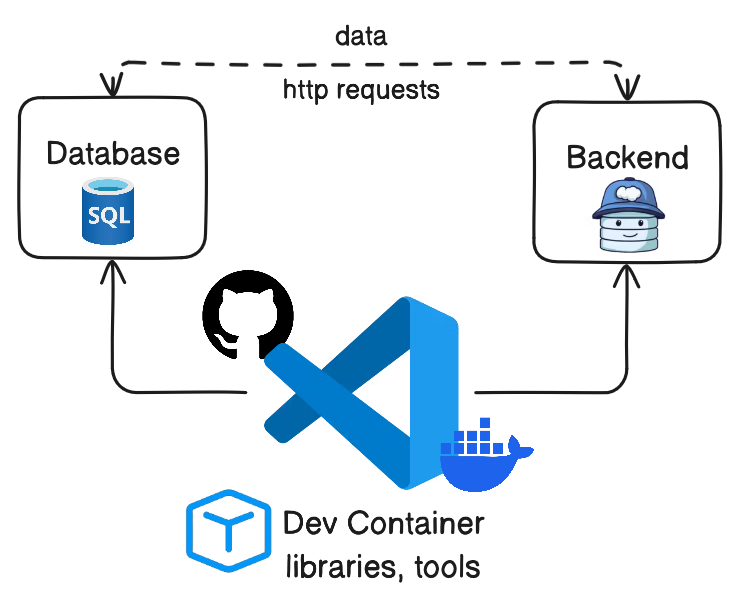

## Il Problema dell'Ambiente di Sviluppo: "Funziona sulla Mia Macchina\!"

Quante volte hai sentito o pronunciato la fatidica frase **"Funziona sulla mia macchina\!"**? È la criptonite della collaborazione tra sviluppatori. Ogni membro del team configura il proprio ambiente in modo leggermente diverso: versioni di linguaggio discordanti, dipendenze mancanti o variabili d'ambiente non allineate. Questo porta a ore sprecate per il debugging del setup, rallentando l'onboarding di nuovi membri e creando incongruenze tra l'ambiente di sviluppo e quello di produzione.

Nei moderni sistemi distribuiti e nelle architetture a microservizi, dove un progetto può dipendere da molteplici linguaggi, database e servizi, la complessità di mantenere ambienti coerenti esplode. Configurare tutto a mano è un incubo. È qui che i **DevContainers** entrano in gioco come una soluzione elegante e potente.

-----

### DevContainers: L'Ambiente di Sviluppo Contenitorizzato

I **DevContainers** (o "Development Containers") sono una funzionalità di Visual Studio Code (VS Code) che ti permette di usare un container **Docker** come ambiente di sviluppo completo. In pratica, il tuo codice è montato nel container e tutte le operazioni di sviluppo (editing, debugging, esecuzione di comandi, installazione di dipendenze) avvengono all'interno di questo ambiente isolato e riproducibile.

Il concetto è semplice ma rivoluzionario: invece di configurare la tua macchina locale per ogni progetto, puoi definire un ambiente di sviluppo ideale una sola volta in un file di configurazione. Chiunque apra il progetto con VS Code e Docker otterrà automaticamente lo stesso identico ambiente, indipendentemente dal proprio sistema operativo.



#### Come Funzionano

Al centro dei DevContainers ci sono due componenti principali:

  - **VS Code**: L'IDE stesso, che esegue un "server remoto" all'interno del container, permettendoti di interagire con i file e gli strumenti come se fossero locali.
  - **Docker**: Il motore di containerizzazione che ospita l'ambiente di sviluppo.

Quando apri un progetto configurato con DevContainers in VS Code, l'IDE rileva la configurazione, costruisce e avvia un container Docker, monta il tuo codice e installa le estensioni specificate. A questo punto, la tua interfaccia VS Code si connette al container, e tutti i comandi da terminale, il debugging e le installazioni avvengono all'interno dell'ambiente contenitorizzato.

-----

### Anatomia di un DevContainer: la Cartella `.devcontainer`

Il cuore di un DevContainer è la cartella `.devcontainer` alla radice del tuo progetto, che contiene i file di configurazione che definiscono l'ambiente.

#### 1\. `devcontainer.json`

Questo è il file di configurazione principale. È un file JSON che specifica come costruire e configurare il tuo ambiente.

```json
// .devcontainer/devcontainer.json
{
  "name": "My Python App Dev Environment", // Nome visualizzato del DevContainer
  "image": "mcr.microsoft.com/devcontainers/python:0-3.11", // Immagine Docker predefinita
  // Oppure: "dockerFile": "Dockerfile", // Se usi un Dockerfile personalizzato
  "features": {
    "ghcr.io/devcontainers/features/docker-in-docker:2": {
      "version": "latest"
    },
    "ghcr.io/devcontainers/features/node:1": {
      "version": "latest"
    },
    "ghcr.io/devcontainers/features/common-utils:2": {
      "installZsh": true,
      "installOhMyZsh": true
    }
  },
  "customizations": {
    "vscode": {
      "extensions": [
        "ms-python.python",
        "ms-azuretools.vscode-docker",
        "redhat.vscode-yaml",
        "esbenp.prettier-vscode"
      ],
      "settings": {
        "python.defaultInterpreterPath": "/usr/local/bin/python"
      }
    }
  },
  "postCreateCommand": "pip install -r requirements.txt",
  "forwardPorts": [3000, 8000],
  "remoteUser": "vscode"
}
```

Per una guida completa su tutte le proprietà disponibili, consulta la [documentazione ufficiale](https://code.visualstudio.com/docs/devcontainers/create-dev-container).

#### 2\. `Dockerfile` (Opzionale)

Per un controllo più granulare, puoi usare un `Dockerfile` personalizzato.

```dockerfile
# .devcontainer/Dockerfile
ARG VARIANT="3.11"
FROM mcr.microsoft.com/devcontainers/python:${VARIANT}

# Installare dipendenze di sistema aggiuntive
RUN apt-get update && export DEBIAN_FRONTEND=noninteractive \
    && apt-get -y install --no-install-recommends git curl make build-essential \
    && rm -rf /var/lib/apt/lists/*

# Configurare il working directory
WORKDIR /workspace

# Impostare un entrypoint predefinito (se necessario)
ENTRYPOINT ["/usr/local/bin/python"]
```

Il Dockerfile ti offre la flessibilità di installare pacchetti a livello di sistema e personalizzare l'immagine base.

#### 3\. `docker-compose.yml` (Per Architetture Multi-Servizio)

Quando il tuo progetto include più servizi (es. un'app web, un database e un broker di messaggi), un `docker-compose.yml` è essenziale.

```yaml
# .devcontainer/docker-compose.yml
version: '3.8'
services:
  # Servizio principale, la tua app, che sarà l'ambiente di sviluppo
  app:
    build:
      context: ../my-app
      dockerfile: Dockerfile
    volumes:
      - ..:/workspaces:cached
    command: sleep infinity
    ports:
      - "8000:8000"

  # Servizio database di esempio
  database:
    image: postgres:15
    environment:
      POSTGRES_DB: mydb
      POSTGRES_USER: user
      POSTGRES_PASSWORD: password
    ports:
      - "5432:5432"

  # Servizio Kafka di esempio
  kafka:
    image: confluentinc/cp-kafka:7.6.0
    ports:
      - "9092:9092"
    environment:
      KAFKA_BROKER_ID: 1
      KAFKA_ZOOKEEPER_CONNECT: 'zookeeper:2181'
      KAFKA_ADVERTISED_LISTENERS: PLAINTEXT://kafka:9092
      KAFKA_OFFSETS_TOPIC_REPLICATION_FACTOR: 1
    depends_on:
      - zookeeper
  zookeeper:
    image: confluentinc/cp-zookeeper:7.6.0
    ports:
      - "2181:2181"
    environment:
      ZOOKEEPER_CLIENT_PORT: 2181
      ZOOKEEPER_TICK_TIME: 2000
```

In questo caso, VS Code usa il `docker-compose.yml` per avviare tutti i servizi, garantendo che l'app possa comunicare con gli altri componenti. Il `devcontainer.json` punterà a questo file per specificare l'ambiente di sviluppo.

-----

### DevContainers e la Developer Experience (DX)

L'adozione dei DevContainers porta a numerosi benefici, il cui impatto maggiore è sulla **Developer Experience (DX)**, ovvero le interazioni e le sensazioni che uno sviluppatore prova mentre lavora. I DevContainers migliorano la DX in modi significativi:

  - **Onboarding Semplificato e Veloce**: Un nuovo sviluppatore può iniziare a lavorare su un progetto complesso in pochi minuti, riducendo la frustrazione e i ritardi.
  - **Eliminazione del "Funziona sulla Mia Macchina"**: I DevContainers garantiscono che tutti i membri del team lavorino nello stesso ambiente, risolvendo alla radice la maggior parte dei problemi legati a discrepanze di configurazione.
  - **Isolamento Progetto per Progetto**: Puoi lavorare su più progetti con stack tecnologici diversi senza preoccuparti di conflitti, perché ogni progetto ha il suo ambiente isolato.
  - **Coerenza con la Produzione**: Avere un ambiente di sviluppo che rispecchia fedelmente quello di produzione riduce le sorprese al momento del deployment, infondendo maggiore fiducia.
  - **Collaborazione Senza Attrito**: I DevContainers facilitano la condivisione degli ambienti per il debugging, riducendo il tempo necessario per risolvere i problemi.
  - **Sperimentazione Sicura**: Puoi provare nuove versioni di linguaggi o librerie all'interno del container senza timore di "sporcare" la tua macchina locale.

In sintesi, i DevContainers spostano il focus dal "come configuro il mio ambiente?" al "come posso risolvere questo problema di business?". Questo non solo aumenta la produttività, ma rende l'esperienza di sviluppo molto più piacevole, fluida e meno frustrante.

-----

### Sfide e Best Practices

Sebbene i DevContainers offrano enormi vantaggi, è bene tenere a mente alcune considerazioni.

#### Sfide

  - **Requisiti Docker**: Richiede che Docker sia installato e funzionante sulla macchina locale. Per maggiori dettagli, visita [**Installazione di Docker Desktop**](https://www.docker.com/products/docker-desktop/).
  - **Overhead Iniziale**: La prima volta che si apre un progetto, la costruzione dell'immagine può richiedere del tempo.
  - **Dimensionamento**: Un `docker-compose.yml` con molti servizi può consumare risorse significative di CPU e RAM.
  - **Debugging di Docker**: Se ci sono problemi con il container, il debugging può essere più complesso per i principianti.

#### Best Practice

  - **Immagini Base Ottimizzate**: Inizia con immagini DevContainer ufficiali, già ottimizzate per gli ambienti di sviluppo. Puoi esplorare il catalogo su [**DevContainers Features**](https://containers.dev/features).
  - **Layer di Cache Docker**: Sfrutta la cache dei layer di Docker per accelerare le ricostruzioni.
  - **`features` vs `Dockerfile`**: Usa le `features` di DevContainers per aggiungere strumenti comuni e riserva il `Dockerfile` per le personalizzazioni uniche del tuo progetto.
  - **Minimizza le Dipendenze**: Installa solo ciò che è strettamente necessario nel tuo DevContainer.
  - **Gestione delle Porte**: Assicurati che tutte le porte necessarie siano correttamente mappate.
  - **Dotfiles**: Usa le funzionalità di VS Code per sincronizzare i tuoi dotfiles nel DevContainer, per un'esperienza più familiare.
  - **Monitoraggio Risorse**: Tieni d'occhio l'utilizzo delle risorse del tuo Docker Desktop/Engine.

-----

### Conclusioni: Un Must-Have per lo Sviluppo Moderno

I DevContainers sono più di una semplice comodità; sono un cambiamento di paradigma nel modo in cui pensiamo agli ambienti di sviluppo. Automatizzando il setup ed eliminando le incongruenze, permettono ai team di essere più produttivi, di collaborare più efficacemente e di mantenere una maggiore coerenza tra gli ambienti di sviluppo e di produzione.

Se lavori su architetture complesse, sistemi distribuiti o semplicemente vuoi eliminare i mal di testa legati alla configurazione dell'ambiente, i DevContainers sono uno strumento che merita assolutamente di essere nel tuo arsenale. Preparano la strada per un flusso di lavoro più snello, riproducibile e, in definitiva, più piacevole.


